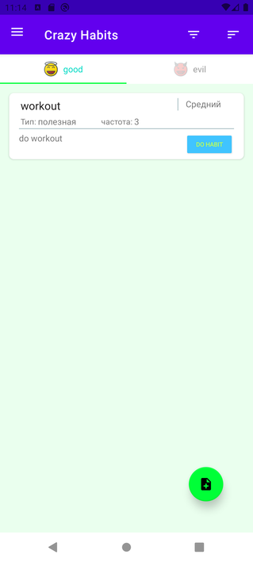
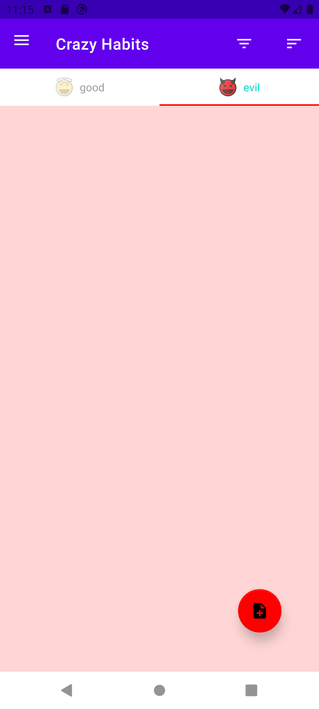
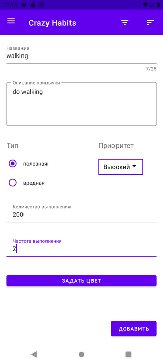
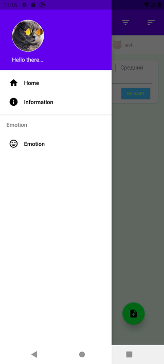

# Crazy habits  

Небольшой pet-проект с использованием MVVM+Clean architecture. Мультимодульное приложение для ведения плохих и хороших привычек.
Для Android 12 (API 31) и выше Splash Screen будет анимированным.

==

Стек:
- Android SDK
- Room
- Hilt
- Coroutines
- Flow
- Retrofit
- Navigation Component
- Coil
- RecyclerView
- ViewPager
- DrawerLayout
- SplashScreen

==

- Kaspresso
- Mockk
- Hamcrest
- Robolectric
- Espresso
- Junit

Список привычек 

 

Добавление привычки

==

